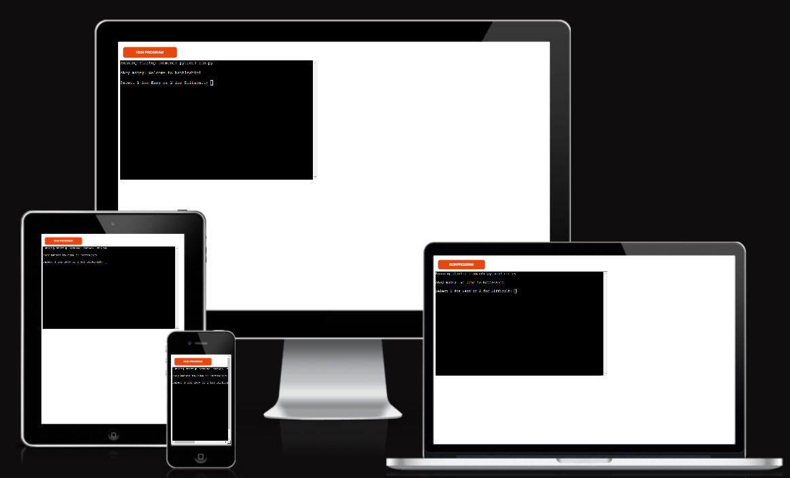
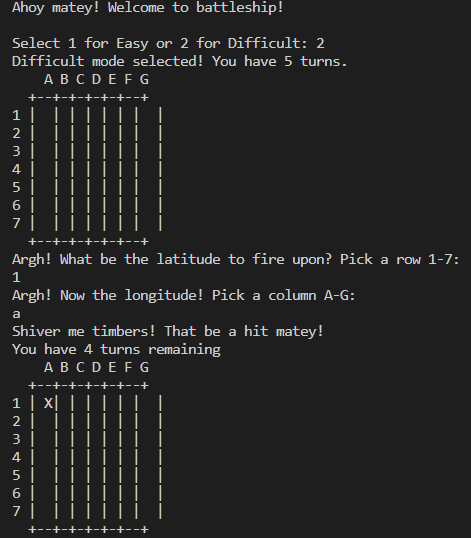
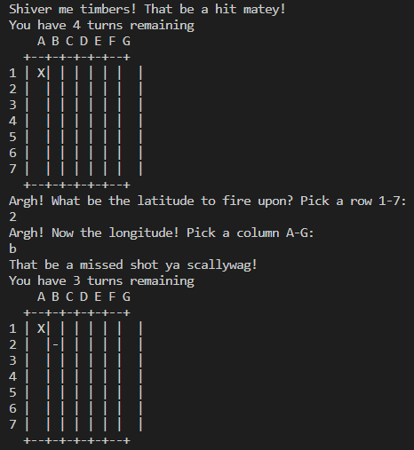
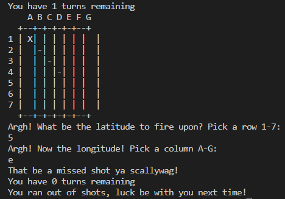
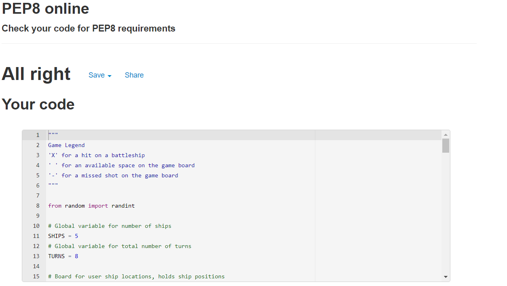
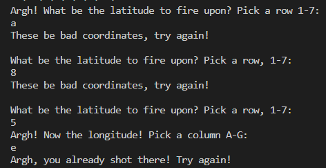
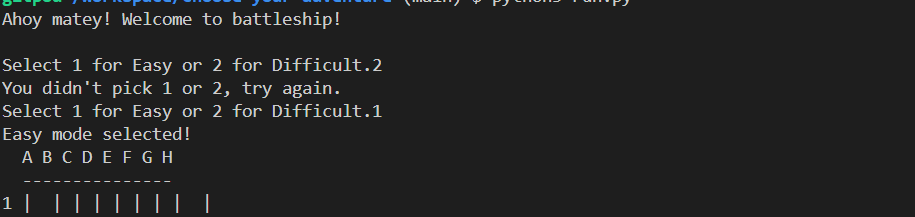

# Battleship!

Battleship is a Python terminal game which runs in the Code Insititue mock terminal on Heroku.
The user plays a 1-player battleship game, searching for ships on a hidden board.

* A link to the deployed site can be found [here](https://battleship-cl2.herokuapp.com/).
* A link to the GitHub repository can be found [here](https://github.com/christianlund2/battleship).

## How to play

Ahoy! Battleship is a classic game of luck and skill! Fire your cannons at the enemy grid, locate and sink their fleet and rule the high seas! Will you be victorious or be doomed to the depths of Davy Jones Locker?

Ship loctions are randomly generated and occupy a 1x1 tile.

There are 5 enemy ships to sink. 

Hits are designated with an 'X', misses by a '-', and available spaces by " "

## Features

### Existing Features

* In 'Easy Mode', the user gets 8 shots to fire, in 'Difficult Mode', the user only gets 5 shots.
* Randomized ship locations on the playing board.
* Validated user input for shot coordinates - checks initial shots and also for duplicate shot locations.
* If the chosen point is not on the grid, the game tells the user to enter a valid position. 
* If the user fires at a position that has already been used, the game informs them the coordinates have been used and to choose again. 
* Informs the user if the selected coordinates are a hit or miss. 
* Informs user the number of shots remaining.
* Informs the user the game is over, either with no remaining shots or that all ships have been destroyed.

### Game Images
* Starting Screen
  - The game initializes, welcomes the user and asks for the desired difficulty setting.

* Game Page
  - Asks the user to input a set of coordinates to fire on the game board. 
  - After selecting a row and column to fire at, the game informs the user if the shot hit or missed, as well as the total number of shots remaining. 

* Game Over
  - After all shots have been fired or all ships have been sunk, the game ends.

## Features Left to Implement
* A future feature I would like to add is an option for the user to select the position of their own ships on the grid.
* Also the ability for the user to set the size of the game grid.

## Data Model

* Functions are utilized to avoid repetitive code blocks.

* Methods are used to provide interactive responses to the users input such as shot locations, difficulty settings and end game comments, as well as print/return instructions based on gameplay.

## Testing
* This project passed through PEP8 with no issues returned.

* Validated User Input
  - Coordinates must be within the grid.
  - Must be letters or numbers in the correct input field.
  - Cannot be duplicate entries.

## Bugs
### Solved Bugs
* When creating the difficulty setting, the 'Difficult Mode' didn't work. It would give an invalid response message with the number 2 selected. This was due to a typo on line 89, the number was '1' from the copy/paste of the 'Easy Mode' not being corrected. 

### Remaining Bugs
* No bugs remaining.

## Deployment
1. This site was deployed to Heroku.
* Create a fork or a clone of the 'Battleship" repository.
* Go to the Heroku page, and create a new app.
* When selecting the buildbacks, choose python and NodeJS, in that order.
* Link the create Heroku app to the "Battleship" repository.
* Select 'Deploy'.

## Credits and Acknowledgements

1. Code Institute for the Love Sandwiches walkthrough and project template.

2. Youtube: "How to Code Battleship in Python - Single Player Game" by Knowledge Mavens, and the creators' associated GitHub, Garrett Broughton.

3. Pythondex - Python Battleship Game.

4. The reddit community "r/learnpython" for tips and considerations.

5. Geeks for Geeks.

6. Stack Overflow.

7. My lovely wife for help with the difficulty function.